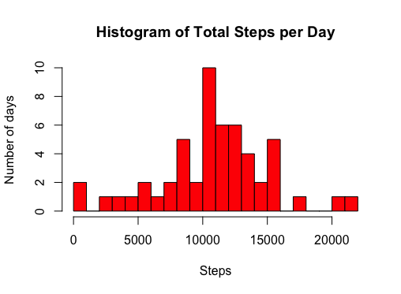
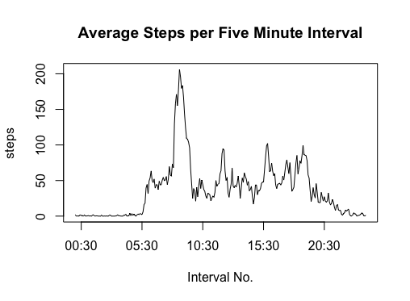
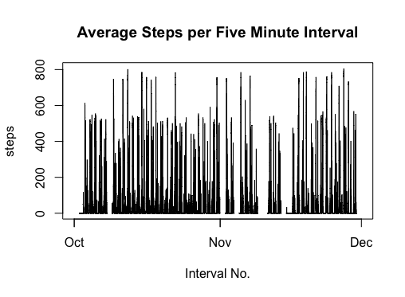
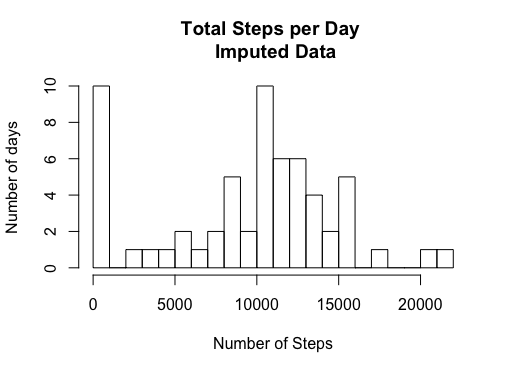
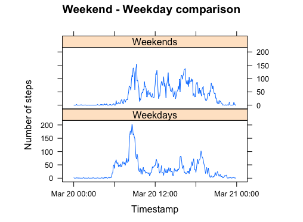

```r
knitr::opts_chunk$set(echo = TRUE)
```

# Analysis of User activity through activity montitoring devices

### Introduction

It is now possible to collect a large amount of data about personal movement using activity monitoring devices such as a Fitbit, Nike Fuelband, or Jawbone Up. These type of devices are part of the “quantified self” movement – a group of enthusiasts who take measurements about themselves regularly to improve their health, to find patterns in their behavior, or because they are tech geeks. But these data remain under-utilized both because the raw data are hard to obtain and there is a lack of statistical methods and software for processing and interpreting the data.

This assignment makes use of data from a personal activity monitoring device. This device collects data at 5 minute intervals through out the day. The data consists of two months of data from an anonymous individual collected during the months of October and November, 2012 and include the number of steps taken in 5 minute intervals each day.

## Metadata information

The variables included in this dataset are:

steps: Number of steps taking in a 5-minute interval (missing values are coded as 𝙽𝙰)
date: The date on which the measurement was taken in YYYY-MM-DD format
interval: Identifier for the 5-minute interval in which measurement was taken

## Analysis

Loading the required libraries

```r
library(ggplot2)
```
###Code for reading in the dataset and/or processing the data

Let's read the data once it is downoaded from the following link into the working folder
https://d396qusza40orc.cloudfront.net/repdata%2Fdata%2Factivity.zip

```r
data <- read.table(unz("repdata%2Fdata%2Factivity.zip", "activity.csv"), header=T, quote="\"", sep=",")
```

Let's see if the data is imported correctly. Let's also see the summary and the structure of the data


```r
head(data)
summary(data)
str(data)
```

### Histogram of the total number of steps taken each day

We can calculate the number of steps by each day and plot the histogram
```r
dailysummary <- aggregate(steps~date, data = data, FUN = sum, na.rm = TRUE)

hist(dailysummary$steps, breaks=20, main="Histogram of Total Steps per Day", xlab="Steps", ylab="Number of days", col = "red")

```
 

### Mean and median number of steps taken each day

Calculating the mean and median number of steps each day

```r
options(scipen=999)
meansteps <- round(mean(dailysummary$steps),2)
medsteps <- median(dailysummary$steps)
```
The mean number of steps is `r meansteps` and the median number of steps is `r medsteps`

### Time series plot of the average number of steps taken 

First, lets convert the text information in the 'interval' column to timestamp data. Then, we calculate the average number of steps across each 5 minute interval. Once, we have the average number of steps for each 5 minute interval, we can plot it using the plot function
```r
data$timestamp <- as.POSIXct(sprintf("%04d", data$interval), format = "%H%M")
datatimestamp <- aggregate(steps~timestamp, data = data, FUN = mean, na.rm = TRUE)
plot(datatimestamp$timestamp, datatimestamp$steps, type="l", main="Average Steps per Five Minute Interval",
     xlab="Interval No.", ylab="steps")

```
 

Also, we could plot the data across the three month timeperiod
```r
data$timestamp1 <- as.POSIXct(paste(data$date, sprintf("%04d", data$interval), sep = " "), format = "%Y-%m-%d %H%M")

plot(data$timestamp1, data$steps, type="l", main="Average Steps per Five Minute Interval",
     xlab="Interval No.", ylab="steps")

```
 


### The 5-minute interval that, on average, contains the maximum number of steps


```r
maxtimestamp <- data[which(data$steps == max(data$steps, na.rm = TRUE)), "timestamp1"]

```

The 5 minute interval with the highest number of steps was `r maxtimestamp`


### Code to describe and show a strategy for imputing missing data

First let's see the number of missing values in each of the columns of the data
```r
apply(data, 2, function(x){sum(is.na(x))})
```

So we observe that we have missing data in the "steps" column

We will now replace the missing values in the steps column using the moving average technique. We will use the "imputeTS" package in the process

```r
library(imputeTS)
data$steps1 <- na.ma(data$steps, k = 8, weighting = "linear")
```

### Histogram of the total number of steps taken each day after missing values are imputed

Now that we have imputed the missing values, we can create the histogram again and see the distribution.

```r
betterdailysummary <- aggregate(steps1 ~ date, data=data, sum, na.rm=TRUE)
hist(betterdailysummary$steps1, breaks=20, main="Total Steps per Day \n Imputed Data",
     xlab="Number of Steps", ylab="Number of days")
```
 

### Panel plot comparing the average number of steps taken per 5-minute interval across weekdays and weekends

Lets first find out the weekday for the date column. Then, we could classify the day to weekends or weekdays. We will use the weekdays function in R

```r
data$weekday <- weekdays(as.Date(data$date, format = "%Y-%m-%d"))
data$weekdayflag <- ifelse(data$weekday %in% c("Saturday", "Sunday"), "Weekends","Weekdays")
```

```r 
library(lattice)
plotdata <- aggregate(steps1 ~ timestamp + weekdayflag, data, mean)
xyplot(steps1 ~ timestamp | factor(weekdayflag), data=plotdata, aspect=1/3, type="l", xlab = "Timestamp", ylab = "Number of steps", main = "Weekend - Weekday comparison")
```


We notice that the activities on weekdays are concentrated during the morning hours, whereas the activities during the weekends are almost evenly distributed throughout the day. 
